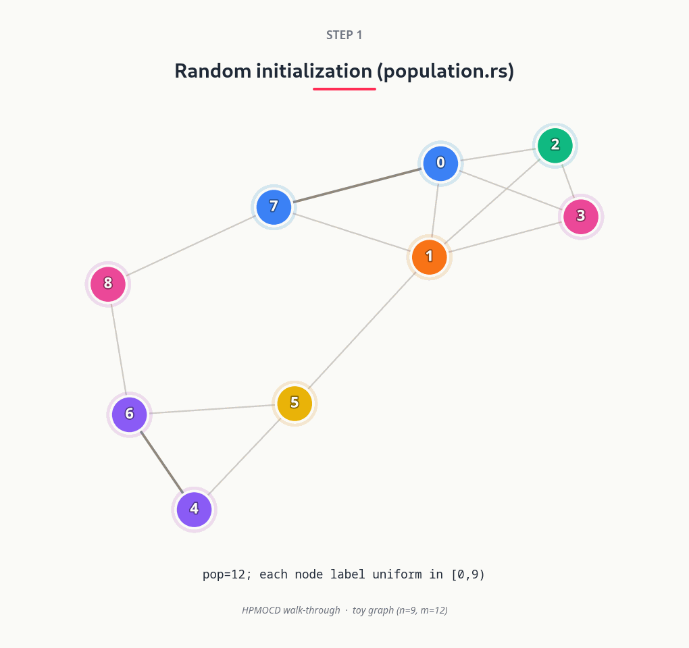

<div align="center">
    
  
  <strong>Multi-Objective Community Detection Algorithms</strong>  

[](https://github.com/oliveira-sh/pymocd/actions/workflows/release.yml)


</div>

**pymocd** is a Python library, powered by a Rust backend, for performing efficient multi-objective evolutionary community detection in complex networks. This library is designed to deliver enhanced performance compared to traditional methods, making it particularly well-suited for analyzing large-scale graphs.

**Navigate the [Documentation](https://oliveira-sh.github.io/dpymocd/) for detailed guidance and usage instructions.**

---

### Community Detection

The `HP-MOCD` algorithm for example, identifies community structures within a graph. It proposes a solution by grouping nodes into distinct communities, as illustrated below:

<p align="center">
  
</p>

### Getting Started

Installing the library using pip interface:

```bash
pip install pymocd
```

For an easy usage:

```python
import networkx
import pymocd

G = networkx.Graph() # Your graph
alg = pymocd.HpMocd(G)
communities = alg.run()
```

> [!IMPORTANT]
> Graphs must be provided in **NetworkX** or **Igraph** compatible format.

Refer to the official **[Documentation](https://oliveira-sh.github.io/dpymocd/)** for detailed instructions and more usage examples.

### Implemented multi-objective community detection algorithms

All detectors below return a single crisp partition (`dict[node, community]`, isolated nodes → `-1`). The classical MOCD baselines (MOGA-Net, Shi-MOCD) are re-implemented on a shared evolutionary backbone for fair comparison, since the original authors released no code.

| Algorithm | Python API | Framework | Objectives | Single-partition selection | Reference | Year |
|---|---|---|---|---|---|---|
| **Ariadne** *(this work)* | `ariadne`, `ariadne_fronts` | NSGA-II — auto-γ islands + elite-ring migration | bi-objective CPM (intra / inter density) | label-free SBM / MDL | this repository (`res/article`) | 2026 |
| **HP-MOCD** | `hpmocd`, `HpMocd` | parallel NSGA-II, topology-aware operators | decomposed modularity (intra / inter) | max modularity *Q* | [Santos et al., *Soc. Netw. Anal. Min.* **15**:110](https://doi.org/10.1007/s13278-025-01519-7) ([arXiv](https://arxiv.org/abs/2506.01752)) | 2025 |
| **Shi-MOCD** | `mocd_q`, `mocd_d` | PESA-II, locus-based encoding | decomposed modularity (intra / inter) | **MOCD-Q** (max *Q*, Eq. 3.8) · **MOCD-D** (max-min distance to degree-preserving control fronts, Eq. 3.9–3.11) | [Shi et al., *Appl. Soft Comput.* **12**(2):850–859](https://doi.org/10.1016/j.asoc.2011.10.005) | 2012 |
| **MOGA-Net** | `moga_net` | NSGA-II, locus-based encoding | community score + community fitness (both maximized) | max modularity *Q* | [Pizzuti, *ICTAI 2009*, 379–386](https://doi.org/10.1109/ICTAI.2009.58) ([IEEE TEC ext.](https://doi.org/10.1109/TEVC.2011.2161090)) | 2009 |
| **NSGA-III-CCM** | `ccm` | NSGA-III, locus-based encoding | community score + community fitness + modularity (3-objective) | max modularity *Q* | [Shaik, Ravi & Deb, *SN Comput. Sci.* **2**:13](https://doi.org/10.1007/s42979-020-00382-x) | 2021 |
| **NSGA-III-KRM** | `krm` | NSGA-III, locus-based encoding | kernel *k*-means + ratio cut + modularity (3-objective) | max modularity *Q* | [Shaik, Ravi & Deb, *SN Comput. Sci.* **2**:13](https://doi.org/10.1007/s42979-020-00382-x) | 2021 |

```python
import pymocd
part_q = pymocd.mocd_q(G)   # Shi-MOCD, max-modularity selection.
part_d = pymocd.mocd_d(G)   # Shi-MOCD, max-min-distance selection.
part_m = pymocd.moga_net(G) # Pizzuti, MOGA-Net.
part_c = pymocd.ccm(G)      # Shaik et al., NSGA-III-CCM.
part_k = pymocd.krm(G)      # Shaik et al., NSGA-III-KRM.
part_h = pymocd.hpmocd(G)   # Santos, HP-MOCD.
part_a = pymocd.ariadne(G)  # Santos, Ariadne.

# Every part_ Returns the selected partition:
# dict[node, community]. Isolated nodes get -1.
```

### Contributing

We welcome contributions to `pymocd`\! If you have ideas for new features, bug fixes, or other improvements, please feel free to open an issue or submit a pull request. This project is licensed under the **GPL-3.0 or later**.

---

### Citation

If you use any algorithm in your research, please cite the following paper:

```bibtex
@article{Santos2025,
  author    = {Santos, Guilherme O. and Vieira, Lucas S. and Rossetti, Giulio and Ferreira, Carlos H. G. and Moreira, Gladston J. P.},
  title     = {A high-performance evolutionary multiobjective community detection algorithm},
  journal   = {Social Network Analysis and Mining},
  year      = {2025},
  volume    = {15},
  number    = {1},
  pages     = {110},
  doi       = {10.1007/s13278-025-01519-7},
  url       = {https://doi.org/10.1007/s13278-025-01519-7},
  issn      = {1869-5469},
  date      = {2025-11-18}
}
```
