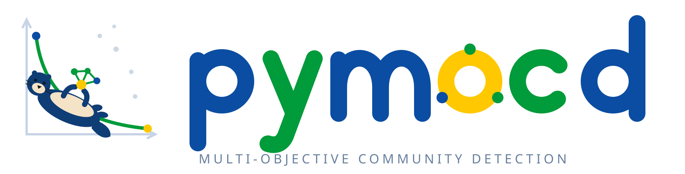

---
hide:
  - navigation
  - toc
---

<div class="pymocd-hero" markdown>

<h1 class="pymocd-sr-title">pymocd</h1>

{ .pymocd-hero-logo }

Evolutionary community detection for Python, with the heavy lifting done in parallel Rust.

[Getting started](getting-started.md){ .md-button .md-button--primary }
[API reference](api/detectors.md){ .md-button }

</div>

```bash
pip install pymocd
```

<div class="pymocd-highlights">
  <div>
    <strong>Rust + PyO3 core</strong>
    <span>Rayon parallelism on every core</span>
  </div>
  <div>
    <strong>NSGA-II · NSGA-III · PESA-II</strong>
    <span>Multi-objective evolutionary engines</span>
  </div>
  <div>
    <strong>GPL-3.0-or-later</strong>
    <span>Free and open source</span>
  </div>
</div>

<div class="grid cards" markdown>

- :material-rocket-launch:{ .lg .middle } **Fast by construction**

    ---

    The core is written in Rust with PyO3 bindings and Rayon data
    parallelism — evolutionary search scales across every core you
    give it with `max_cores`.

- :material-power-plug:{ .lg .middle } **Drop-in for NetworkX and igraph**

    ---

    Pass your `networkx.Graph` or `igraph.Graph` directly. Every
    detector returns a plain `dict` mapping node to community.

- :material-flask:{ .lg .middle } **Learn by example**

    ---

    Plot detected communities, plug in custom objectives, and walk
    Pareto fronts with copy-paste-runnable examples.

    [:octicons-arrow-right-24: Examples](examples/plotting.md)

</div>

!!! quote "Citing pymocd"

    If you use any of these algorithms in your research, please cite the
    HP-MOCD paper ([SNAM, 2025](https://doi.org/10.1007/s13278-025-01519-7)):

    ```bibtex
    @article{Santos2025,
      author    = {Santos, Guilherme O. and Vieira, Lucas S. and Rossetti, Giulio and Ferreira, Carlos H. G. and Moreira, Gladston J. P.},
      title     = {A high-performance evolutionary multiobjective community detection algorithm},
      journal   = {Social Network Analysis and Mining},
      year      = {2025},
      volume    = {15},
      number    = {1},
      pages     = {110},
      doi       = {10.1007/s13278-025-01519-7},
      url       = {https://doi.org/10.1007/s13278-025-01519-7},
      issn      = {1869-5469},
      date      = {2025-11-18}
    }
    ```
